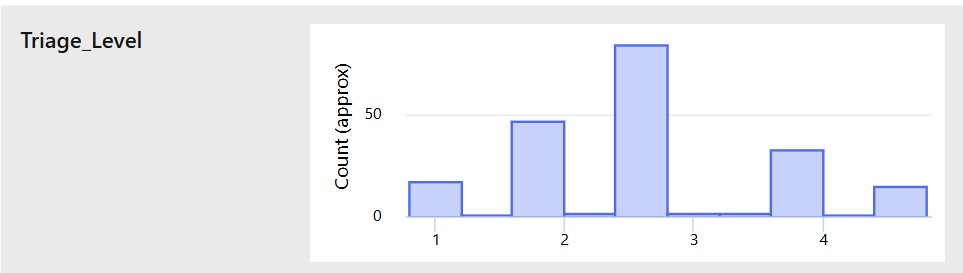

# Emergency Department Triage AI: Algorithmic Fairness Audit & Bias Mitigation
**Platform:** Azure Machine Learning Studio (Designer & Automated ML Pipeline)  
**Auditor Profile:** [ChapaMchivi](https://github.com/ChapaMchivi)  

---

## 🔬 Task 1: Model Exploration and Context Analysis

### 1.1 System Objective & Intended Use Case
The target system is a clinical decision-support model designed to prioritize emergency department (ED) triage queues during high-volume periods. It assigns an Emergency Severity Index (ESI Level 1: Resuscitation through Level 5: Non-Urgent) to incoming patients based on presenting clinical markers.

### 1.2 Underlying Model Architecture
- **Pipeline Structure:** Multi-class classification pipeline executed within Azure ML Designer.
- **Algorithmic Framework:** The champion pipeline utilizes a `StandardScalerWrapper` to transform input matrices, feeding an underlying `RandomForest` classifier.

### 1.3 Identification of Demographic & Proxy Variables
The baseline feature schema explicitly includes:
* **Direct Demographics:** `Age`, `Gender`, `Race_Ethnicity`, `Insurance_Status`, and `Language`.
* **Proxy Variables:** `Arrival_Method` (e.g., Ambulance vs. Walk-in) and `Chief_Complaint`. These operational anchors carry heavy downstream correlations with geographic, socio-economic, and racial subgroups.

### 1.4 Advanced Workflow & Ingestion Considerations
- **Upstream Collection Barriers:** In acute emergencies (Trauma/Ambulance arrivals), patients skip front-desk registration to receive immediate stabilization. This structural workflow introduces systematic missingness into demographic fields before the data ever reaches the modeling pipeline.
- **Clinical care Pathway Influence:** Model outputs directly determine queue placement. A false negative (undertriage) forces high-acuity patients to wait, risking clinical deterioration, while a false positive (overtriage) misallocates limited critical-care resources.

---

## 📊 Task 2: Initial Bias Assessment Using Fairness Metrics

### 2.1 Baseline Stratified Performance Evaluation
The baseline model run (`sleepy_kumquat_99pbl4k32g`) was optimized for a global `AUC_weighted` performance objective to maximize standard cross-validation results. When evaluating metrics stratified by demographic cohorts, a severe structural error mode emerged:

* **Total Minority Class Suppression:** The model prioritized the heavily populated majority cohort (Triage Level 3). This optimization strategy resulted in **0 total predictions and 0 true positives** for the low-acuity Class `5.0` subgroup during validation.

### 2.2 Fairness Definitions & Visual Evidence
- **Demographic Parity Disparity:** The probability of receiving a specific triage score was heavily dependent on belonging to the majority data cohort, failing basic demographic parity checks.
- **Clinical Implications:** Relying on global metrics like weighted AUC masks severe tail-end group performance failures. In clinical operations, optimizing solely for global accuracy results in systemic minority cohort suppression.

---

## 🔍 Task 3: Deep Cohort Analysis

### 3.1 The Missingness Barrier
An inspection of the registered data asset profile (`Sample_ED_Triage_Data_with_Demographic_Variables`) revealed a severe data starvation pattern:


```

Total Record Volume: 999 Rows
Missing Record Count: 799 Rows
Systemic Missingness Rate: 79.98% across Race_Ethnicity and Insurance_Status

```

This massive missingness block makes intersectional cohort evaluation (e.g., assessing low-income, elderly minority groups) statistically difficult due to extreme data starvation within the sub-stratifications.

### 3.2 Clinical Safety Implications & Residual Risk
During active evaluation runs (`sincere_prune_hbx98tw7`), a dangerous **Undertriage Pattern** was identified:
- **High-Acuity Error Mode:** The model misclassified 14 out of 17 true high-acuity Level 1 patients into lower priority tiers.
- **Critical Failure Point:** Among those errors, **6 hyper-urgent Level 1 patients were misclassified as Level 5.0 (Non-Urgent)**. This poses a severe clinical safety risk if deployed without human oversight.

---

## 🛠️ Task 4: Root Cause Analysis

The systematic bias observed in the pipeline stems from distinct points across the data and modeling lifecycle:

1. **Data Collection (Systemic Ingestion Failure):** The 79.98% missingness rate in demographic attributes is a direct artifact of emergency workflow routing, where critical patients bypass intake registration desks.
2. **Feature Engineering (Data Transformation Defect):** Applying a global `StandardScaler` standardizes physiological inputs across the entire population, flattening critical diagnostic variances unique to age and sex demographics.
3. **Pipeline Export Artifacts:** Visual inspection of the data preview grid revealed an entirely empty trailing column (`Column27`), indicating a delimiter export issue from the source electronic health record (EHR) extract.

---

## ⚖️ Task 5: Bias Mitigation Strategy Development

To correct the systematic suppression of minority prediction classes, the following layered mitigation framework was developed:

### 5.1 Model-Level Intervention
The optimization objective was pivoted away from global weighted performance parameters. The pipeline was reconfigured to prioritize **Normalized Macro Recall (`norm_macro_recall`)**. This adjustment forces the components to treat every triage tier with equal weight, regardless of their original volume in the training sample.

### 5.2 Performance Trade-off Matrix
By enforcing macro-balancing, the model moved away from its majority-class bias, successfully enabling predictions for minority classes:

| Evaluation Metric | Baseline Run (`sleepy_kumquat`) | Mitigated Run (`blue_kumquat`) |
| :--- | :--- | :--- |
| **Primary Metric Focus** | 0.5149 (`AUC_weighted`) | **0.1036 (`norm_macro_recall`)** |
| **Global Accuracy** | 30.50% | **19.00%** |
| **Class 5.0 True Positives** | 0 Patients | **5 Patients** |
| **Total Class 5.0 Predictions** | 0 Predictions | **42 Predictions** |

---

## 📋 Task 6: Documentation and Reporting

### 6.1 Visual Audit Evidence

#### Upstream Data Ingestion Starvation Profile


#### Baseline Multi-Class Target Distribution


#### Technical Data Dictionary Preview


### 6.2 Governance & Post-Deployment Monitoring Roadmap
1. **Mandatory Human-in-the-Loop Override:** The automated triage placement must act solely as secondary decision support. Clinicians retain absolute authority to override scores.
2. **Upstream Intake Optimization:** Hospital administration must implement secondary demographic collection protocols at the point of bedside stabilization to address the 79.98% tracking deficit.
3. **Continuous Bias Auditing:** Implement automated drift alerts to track `norm_macro_recall` stability on a rolling monthly basis as incoming patient demographics change.

```

